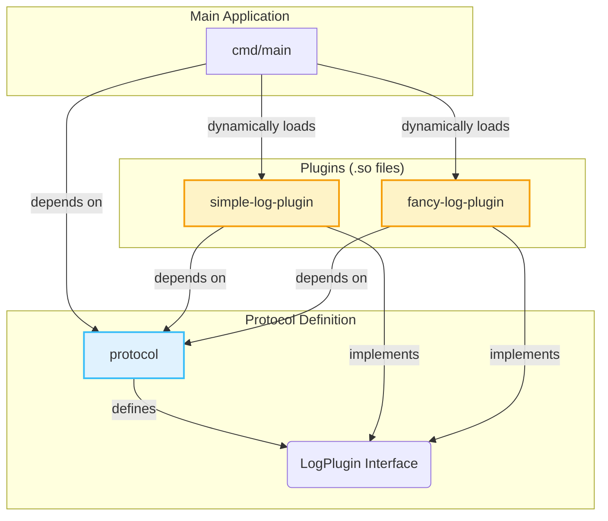
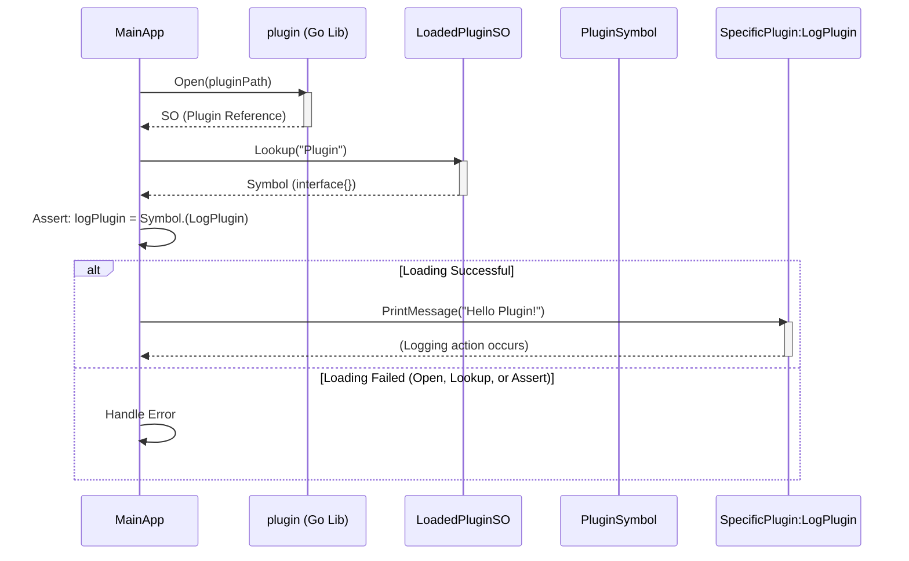

# go-plugin-example
This repo provides a simplified example of how to support plugins in go. Future contributors can can use this as a PoC and continue on this approach for implementing a connectore store for Apache Synpase Go implementation. I wrote a [blog article](https://medium.com/@thisara.weerakoon2001/building-extensible-go-applications-with-plugins-19a4241f3e9a) also on descirbing the concepts behind this simple demo. 

## Component Diagram

This diagram shows the high-level packages/components and their dependencies.

## Sequence Diagram

This diagram shows the sequence of interactions when the main application loads and uses a plugin.

